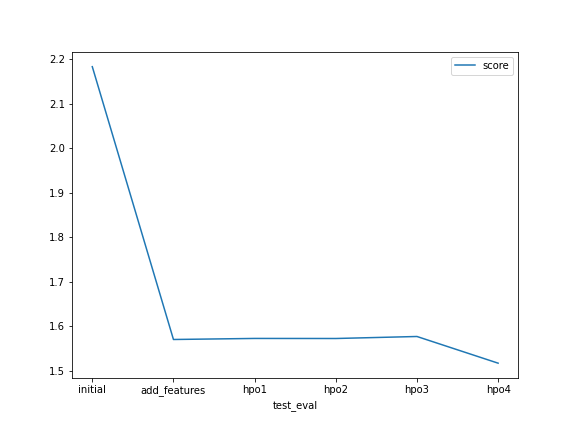

# Report: Predict Bike Sharing Demand with AutoGluon Solution
#### NAME HERE

Andreas Jakl

## Initial Training
### What did you realize when you tried to submit your predictions? What changes were needed to the output of the predictor to submit your results?

Not much unexpected - negative predictions need to be clipped to 0, as there can not be negative bike rentals in a real life scenario. The clip(lower=0) method of the Pandas dataframe can easily take care of removing negative values from the predictions.

### What was the top ranked model that performed?
The top ranked model was actually still the one after add_features; the hyperparameter tuning didn't have any significant differences. Also, granting more time for the training didn't have a large effect on the overall results.

## Exploratory data analysis and feature creation
### What did the exploratory analysis find and how did you add additional features?

I split up the datetime to three separate columns as also recommended - most likely, the classifier couldn't cope too well with the datetime format itself. Of course, I removed the original datetime column.
I did not artifically generate additional new features (e.g., separating the temperature into categories like cold / warm), as an additional feature would expand the feature space and wouldn't add new information with the data already given. Especially with continuous values like the temperature, I think it's better to let the classifier figure out which temperature makes a difference rather than me adding artificial temperature boundaries with not too much domain knowledge about when people rent bikes.

### How much better did your model preform after adding additional features and why do you think that is?
The score improved from 2.18 to 1.57. Splitting the temperature and setting some columns to categorical definitely helped the classifier to perform better.

## Hyper parameter tuning
### How much better did your model preform after trying different hyper parameters?
After three rounds of hyperparameter tuning, the kaggle score didn't change significantly - it always stayed in the range of 1.57. Also adding more time didn't add much. The auto_stack=true automatically set two other hyperparameters according to the data, but also that didn't change much in the overall results.

### If you were given more time with this dataset, where do you think you would spend more time?
Would check the best performing classifier and see if there is anything to optimize for that one.

### Create a table with the models you ran, the hyperparameters modified, and the kaggle score.
Not sure what is expected in this table - initial and add_feature didn't modify any 3 hyperparamters.
Did three runs with adding more tuned hyperparameters (hpo1, hpo2, hpo3)
Added the kaggle score in the last column.

|model|hpo1|hpo2|hpo3|score|
|--|--|--|--|--|
|initial|N/A|N/A|N/A|2.18289|
|add_features|N/A|N/A|N/A|1.56982|
|hpo1|auto_stack=true|||1.57219|
|hpo2|auto_stack=true|num_bag_sets=3||1.57205|
|hpo3|auto_stack=true|num_bag_sets=3|time_limit=1000|1.57656|

### Create a line plot showing the top model score for the three (or more) training runs during the project.

Data used from the fit_summary / leaderboard section of the best-ranked model.

### Create a line plot showing the top kaggle score for the three (or more) prediction submissions during the project.

## Summary

The feature transformation was most useful. Hyperparameter tuning didn't bring much as results; but didn't expect much as AutoGluon is a framework that tries to find the best overall model parameters by itself automatically.
